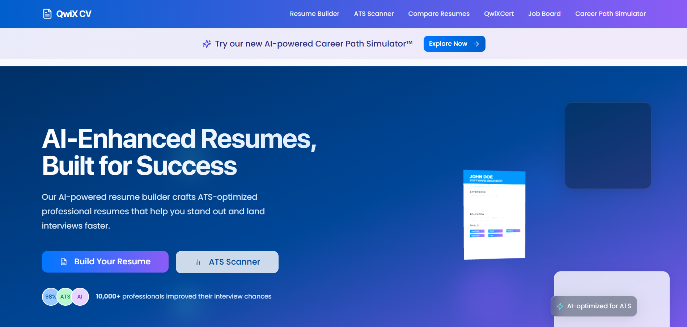

# QWIK CV - AI-Powered Resume Builder

<div align="center">
  <h3>Build ATS-optimized resumes with AI assistance</h3>
</div>



## 🚀 Project Overview

QWIK CV is an advanced resume builder that leverages artificial intelligence to help job seekers create professional, ATS-optimized resumes tailored to specific job descriptions. The platform offers intelligent content suggestions, real-time ATS scoring, resume comparison tools, and automated job matching to streamline the job application process.

## ✨ Key Features

### AI-Powered Resume Generation
- **Smart Content Suggestions**: AI analyzes your input and suggests professional phrasing
- **Section-by-Section Guidance**: Step-by-step assistance for each resume section
- **Customizable Templates**: Professional designs with flexible formatting options
- **Skills Gap Analysis**: Identifies missing skills based on job descriptions

### ATS Optimization
- **Real-time ATS Compatibility Scoring**: See how your resume performs against job descriptions
- **Keyword Optimization**: Intelligent suggestions to improve keyword relevance
- **Format Verification**: Ensures your resume uses ATS-friendly formatting
- **Improvement Recommendations**: Targeted suggestions to boost your ATS score

### Resume Comparison
- **Side-by-Side Visualization**: Compare your resume against job descriptions with visual feedback
- **Keyword Highlighting**: See which skills and qualifications match job requirements
- **Gap Identification**: Quickly spot missing qualifications and skills
- **Match Percentage**: Quantified compatibility score with detailed breakdown

### Job Board & Matching
- **Personalized Job Recommendations**: Tailored job listings based on your resume
- **Search Filters**: Find opportunities by location, company, salary range, and more
- **One-Click Apply**: Streamlined application process with your QWIK CV resume
- **Application Tracking**: Monitor your job applications in one place

### Blockchain Certifications
- **Verifiable Credentials**: Blockchain-secured certifications for skills and achievements
- **Certification Tests**: Online assessments that issue tamper-proof certificates
- **Verification Portal**: Allow employers to verify your credentials
- **Certificate Management**: Control which certifications appear on your resume

### Career Path Simulation
- **Career Trajectory Visualization**: See potential career paths based on your current skills
- **Skill Development Roadmap**: Identify skills needed for career advancement
- **Salary Projections**: View estimated compensation at different career stages
- **Learning Resource Recommendations**: Curated content to develop required skills

## 🛠️ Complete Technology Stack

### Frontend Framework & Core Libraries
- **React 18**: Component-based UI library for building the interactive interface
- **TypeScript**: Statically typed JavaScript for enhanced code quality and developer experience
- **Vite**: Modern, lightning-fast build tool and development server

### Styling & UI Components
- **Tailwind CSS**: Utility-first CSS framework for responsive design
- **shadcn/ui**: High-quality UI components built with Radix UI and Tailwind
- **Radix UI**: Low-level UI component primitives providing accessibility
- **Lucide Icons**: Beautiful, consistent SVG icons
- **@tailwindcss/typography**: Better typography defaults for Tailwind projects
- **Three.js**: JavaScript 3D library for interactive visualizations
- **Recharts**: Composable charting library for data visualization

### State Management & Data Fetching
- **Tanstack Query (React Query)**: Data fetching, caching, and state management
- **Context API**: React's built-in state management for global app state
- **Zustand**: Lightweight state management solution for specific features

### Routing & Form Handling
- **React Router v6**: Declarative routing for single page applications
- **React Hook Form**: Form validation and handling with performance in mind
- **Zod**: TypeScript-first schema validation with static type inference

### Document Generation & File Handling
- **html2pdf.js**: Library for generating PDF documents from HTML content
- **jsPDF**: PDF document generation from JavaScript
- **react-to-print**: Component for printing React components

### Utility Libraries
- **date-fns**: Modern JavaScript date utility library
- **qrcode.react**: QR code generator component for React
- **lodash**: Utility library for common programming tasks

### Web3 & Blockchain Integration
- **ethers.js**: Complete Ethereum library and wallet implementation
- **web3.js**: Ethereum JavaScript API for blockchain interactions
- **IPFS (via HTTP Client)**: Decentralized storage system integration

### Testing & Development Tools
- **Vitest**: Test runner compatible with Vite
- **Testing Library**: Simple and complete testing utilities
- **ESLint**: JavaScript linting utility with TypeScript support
- **Prettier**: Code formatter to maintain consistent style

## 🌟 Feature Details

### Resume Builder

The Resume Builder is a comprehensive multi-step form guiding users through creating a professional resume:

**Personal Information Section**
- Full name and professional title input
- Contact information collection (phone, email, location)
- Professional summary with AI suggestions
- Social media and portfolio links integration

**Education Section**
- Multiple education entries with degree, institution, date ranges
- GPA, honors, and relevant coursework options
- Automatic formatting with chronological ordering
- Educational achievement highlighting

**Experience Section**
- Detailed work history with company, title, location, dates
- AI-assisted bullet point generation for responsibilities
- Achievement-focused content suggestions
- Automatic chronological ordering with most recent first

**Skills & Certifications**
- Skill categorization (technical, soft, language)
- Skill rating system for visual representation
- Certification listing with expiration date tracking
- AI-recommended skills based on entered experience

**Projects & Publications**
- Portfolio projects with descriptions and links
- Publication citations with automatic formatting
- GitHub repository integration
- Media attachment options for visual showcase

**References**
- Reference management with contact information
- Option for "References available upon request"
- Reference letter attachment capability

### ATS Scanner

The ATS Scanner analyzes resumes against job descriptions for optimal matching:

**Job Description Analysis**
- Parse and extract key requirements from job listings
- Identify required skills, qualifications, and experience
- Determine educational requirements and preferences
- Extract company values and culture attributes

**Resume Evaluation**
- Keyword matching against job description
- Formatting compatibility check for ATS systems
- Header and section structure analysis
- File format verification (PDF optimization)

**Scoring Dashboard**
- Overall compatibility percentage
- Section-by-section match analysis
- Keyword presence visualization
- Recommended improvements with priority levels

**Improvement Recommendations**
- Targeted skill additions based on job requirements
- Phrasing enhancements for better keyword matching
- Content restructuring suggestions
- Format optimization recommendations

### Resume Comparison Tool

The Resume Comparison Tool provides visual matching between resumes and job descriptions:

**Side-by-Side Visual Comparison**
- Split-screen view of resume and job description
- Synchronized scrolling for easy reference
- Color-coded highlights for matches and gaps
- Match percentage indicator with breakdown

**Keyword Analysis**
- Highlighted matching keywords and phrases
- Missing keyword identification
- Synonym recognition for conceptual matches
- Industry-specific terminology recommendations

**Interactive Visualization**
- Skill match radar charts
- Experience timeline comparison
- Qualification fulfillment progress bars
- 3D visualization of the matching process (Three.js)

**Detailed Reports**
- Exportable PDF comparison reports
- Executive summary of match quality
- Detailed match breakdown by section
- Specific improvement recommendations

### Blockchain Certification System

The Blockchain Certification System provides verifiable credentials:

**Certification Tests**
- Multiple-choice assessment platform
- Time-limited test sessions
- Automatic scoring and result analysis
- Pass/fail determination with threshold settings

**Certificate Generation**
- Blockchain transaction creation
- Unique hash generation for each certificate
- Smart contract interaction for minting
- PDF certificate generation with verification details

**Verification Portal**
- Certificate lookup by ID or hash
- QR code scanning for instant verification
- Blockchain transaction confirmation
- Certificate authenticity validation

**Certificate Management**
- User certificate dashboard
- Public/private visibility controls
- Certificate sharing capabilities
- Download and export options

### Career Path Simulator

The Career Path Simulator helps users visualize career progression:

**Career Trajectory Visualization**
- Interactive career path timelines
- Multiple path options based on different goals
- Role progression with time estimations
- Branching possibilities for career pivots

**Role Details**
- Comprehensive job descriptions
- Required skills and qualifications
- Typical salary ranges with regional adjustments
- Industry demand forecasts

**Skill Development Planning**
- Gap analysis between current and target roles
- Skill acquisition prioritization
- Learning resource recommendations
- Estimated time investment for skill development

**Salary Projections**
- Career earnings visualization
- Comparison between different paths
- Regional salary adjustment factors
- Industry-specific compensation trends

## 📈 Business Value

QWIK CV delivers significant value to job seekers by:

- **Reducing Application Time**: Streamlining the resume creation and optimization process
- **Increasing Interview Chances**: Improving ATS compatibility and job-specific tailoring
- **Career Development Insights**: Providing clear pathways for professional growth
- **Credential Verification**: Offering blockchain-secured proof of qualifications
- **Automated Job Matching**: Connecting users with relevant opportunities
- **Skill Gap Identification**: Highlighting areas for professional development

## 🚀 Getting Started

### Prerequisites
- Node.js & npm installed - [Install with nvm](https://github.com/nvm-sh/nvm#installing-and-updating)

### Installation

```sh
# Clone the repository
git clone <YOUR_REPO_URL>

# Navigate to the project directory
cd qwik-cv

# Install dependencies
npm install

# Start the development server
npm run dev
```


## 👨‍💻 Development Team

- **Sai Praneeth Reddy Dhadi** 
- **Manideep Reddy Kasireddy** 


## 🙏 Acknowledgements

- Icon library provided by [Lucide Icons](https://lucide.dev/)
- UI components from [shadcn/ui](https://ui.shadcn.com/)
- 3D visualizations powered by [Three.js](https://threejs.org/)
- Blockchain integration inspired by [OpenCerts](https://opencerts.io/)
