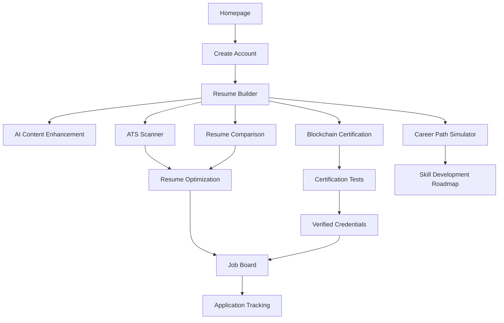

<div align="center">
  
  
  # QWIK CV
  ### AI-Powered Resume Builder
  
  [](https://reactjs.org/)
  [](https://www.typescriptlang.org/)
  [](https://tailwindcss.com/)
  [](https://vitejs.dev/)
  
  **🏆 HackIndia 2025 Hackathon Submission by Team QwikZen**
</div>

## 🚀 About QWIK CV

QWIK CV is an intelligent resume builder that leverages AI to create ATS-optimized resumes tailored to specific job descriptions. Our platform helps job seekers stand out in competitive markets by providing real-time optimization, blockchain-verified credentials, and career planning tools.

## 👥 Team QwikZen

| Name | Role | Contact |
|------|------|---------|
| **Dhadi Sai Praneeth Reddy** | Team Lead & Full Stack Developer | 📱 +91 7416466619 <br> 📧 dspraneeth07@gmail.com |
| **Kasireddy Manideep Reddy** | AI Engineer & Backend Developer | 📱 +91 9390424085 <br> 📧 kasireddymanideepreddy405@gmail.com |

## 🌟 Key Features

- **AI-Powered Resume Generation** - Smart content suggestions with section-by-section guidance
- **ATS Optimization** - Real-time scoring against job descriptions with improvement recommendations
- **Resume Comparison** - Side-by-side visualization with job requirements
- **Blockchain Certifications** - Verifiable credentials secured on blockchain
- **Career Path Simulator** - Visualize potential career trajectories and skill development paths
- **Job Board & Matching** - Personalized job recommendations based on your resume

## 🔄 Website Flow



1. **User Registration/Login**: Create an account to start building your professional profile
2. **Resume Builder**: Create your resume with AI-powered section recommendations
3. **ATS Optimization**: Scan your resume against job descriptions for compatibility
4. **Skills Certification**: Take assessments to earn blockchain-verified credentials
5. **Job Matching**: Discover and apply to relevant positions with your optimized resume
6. **Career Planning**: Explore potential career paths and required skill development

## 💻 Tech Stack

<div align="center">
  <table>
    <tr>
      <td align="center" width="96">
        
        <br>React
      </td>
      <td align="center" width="96">
        
        <br>TypeScript
      </td>
      <td align="center" width="96">
        
        <br>Tailwind
      </td>
      <td align="center" width="96">
        
        <br>Three.js
      </td>
      <td align="center" width="96">
        
        <br>Ethereum
      </td>
    </tr>
    <tr>
      <td align="center" width="96">
        
        <br>Vite
      </td>
      <td align="center" width="96">
        
        <br>React Query
      </td>
      <td align="center" width="96">
        
        <br>Recharts
      </td>
      <td align="center" width="96">
        
        <br>Radix UI
      </td>
      <td align="center" width="96">
        
        <br>shadcn/ui
      </td>
    </tr>
  </table>
</div>

### Frontend Framework & UI
- **React 18** with **TypeScript** for type-safe components
- **Vite** for fast development and optimized production builds
- **Tailwind CSS** for utility-first styling
- **shadcn/ui** components built with Radix UI primitives
- **Lucide Icons** for consistent UI iconography
- **Three.js** for interactive 3D visualizations

### State Management & Data Handling
- **TanStack Query** (React Query) for data fetching & caching
- **React Hook Form** with **Zod** validation
- **Context API** and **Zustand** for state management
- **html2pdf.js** and **jsPDF** for document generation

### Blockchain Integration
- **ethers.js** for Ethereum wallet implementation
- **IPFS** for decentralized storage of certificates

## 🏁 Getting Started

```bash
# Clone the repository
git clone <repo-url>

# Navigate to project directory
cd qwik-cv

# Install dependencies
npm install

# Start development server
npm run dev
```

## 📱 Screenshots

<div align="center">
  
</div>

## 🔗 Links

- [Project Demo](https://qwik-cv.vercel.app)
- [GitHub Repository](https://github.com/dspraneeth07/HackIndia-Spark-6-2025-QWIKZEN)

## 📄 License

This project is licensed under the MIT License - see the LICENSE file for details.
